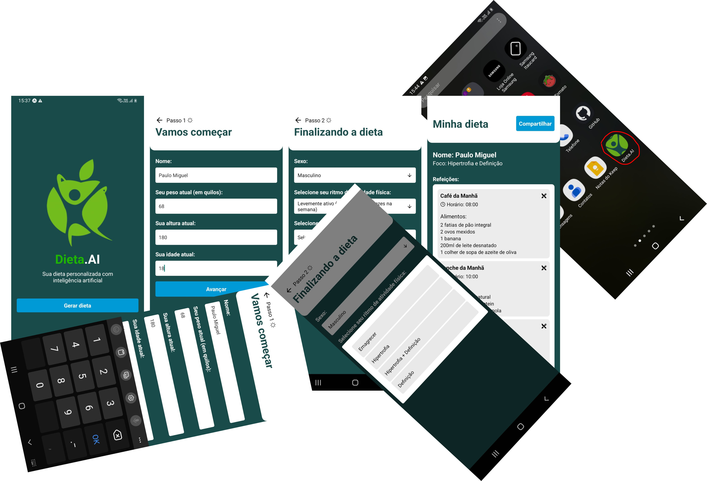

# Dieta.AI


## Sobre ✏️
### A Dieta.AI é um app mobile para criação de dietas personalizadas, a aplicação funciona junto ao [backend](https://github.com/Paulo-Mikhael/dietaai-backend?tab=readme-ov-file#readme) feito para ela, o qual consulta uma inteligência artificial para a geração de dietas, personalizando as refeições sugeridas com base no estilo de vida do usuário e seus dados pessoais, tais como a idade e gênero.

## Tecnologias 💻
<div>
  <abbr title="React Native - Framework Javascript para desenvolvimento mobile" >
    
  </abbr>
  <abbr title="Expo - Framework Javascript para desenvolvimento com React Native" >
    
  </abbr>
  <abbr title="Typescript - Linguagem fortemente tipada">
    
  </abbr>
</div>

## Bibliotecas 📚
<div>
  <abbr title="Zod - Biblioteca para validação de dados">
    
  </abbr>
  <abbr title="React Hook Form - Biblioteca para validação de formulário" >
    
  </abbr>
  <abbr title="Axios - Biblioteca para fazer requisições http">
    
  </abbr>
  <abbr title="Tanstack/React Query - Biblioteca para gerenciar as requisições http">
    
  </abbr>
</div>

## Backend 📥
<div>
  <abbr title="Node.js - Badge para simbolizar o backend feito em node js">
    
  </abbr>
</div>

## Estrutura principal do Projeto 🗃️
```plaintext
┌── app/
│   └── ...
├── assets/
│   └── ...
├── components/
│   └── ...
├── contants/
│   └── ...
├── services/
│   ├── hooks
│   │   └── ...
│   └── atom.ts
├── store/
│   └── ...
└── ...
```
### Descrição:
- app - Contém as páginas da aplicação;
- assets - Contém os arquivos de imagem e de fontes;
- components - Contém os componentes;
- constants - Contém as variáveis globais da aplicação;
- services - Contém as variáveis que são usadas muitas vezes na aplicação;
- store - Contém os estados globais;

## Rodando Localmente (Prompt) 📟
### Clone o projeto
```bash
  git clone https://github.com/Paulo-Mikhael/dietaai-mobile?tab=readme-ov-file#readme
```
### Entre no diretório do projeto
```bash
  cd dietaai-mobile
```
### Instale as dependências
```bash
  npm install
```
### Troque o localhost na url que chama a api em services/api.ts, para o endereço ipv4 da sua máquina, para ver essa informação, digite ipconfig no terminal do windows, ou ifconfig no terminal do macOS/Linux
```typescript
   // services/api.ts
  export const api = axios.create({
      baseURL: "http://ipv4_da_maquina:3333",
   });
```
### Rode o servidor backend localmente ([Mais informações](https://github.com/Paulo-Mikhael/dietaai-backend?tab=readme-ov-file#readme))
### Inicie o servidor
```bash
  npm run dev
```

## Talvez você queira ver 💡
  ### [Portifólio](https://portifolio-react-three.vercel.app/)
  ### [Currículo](https://docs.google.com/document/d/1xhimUtV6EM7c1GtwBwAHsIonX1HjoLSi/edit)

## Confira meus outros projetos 🛠️
  - [in.orbit (front-end) - Aplicação de metas pessoais](https://github.com/Paulo-Mikhael/in-orbit-frontend?tab=readme-ov-file#readme)
  - [in.orbit (back-end) - API de metas](https://github.com/Paulo-Mikhael/in-orbit-backend?tab=readme-ov-file#readme)
  - [Fastask - Gerenciador de Tarefas](https://github.com/Paulo-Mikhael/fastask?tab=readme-ov-file#readme)
  - [Landing Page para uma academia](https://github.com/Paulo-Mikhael/academia-landing-page?tab=readme-ov-file#readme)
  - [Landing Page para um e-commerce de tech](https://github.com/Paulo-Mikhael/phlox?tab=readme-ov-file#readme)
  - [Landing Page para um e-commerce de plantas](https://github.com/Paulo-Mikhael/casa-verde?tab=readme-ov-file#readme)

## Contatos 📞
  [](https://portifolio-react-three.vercel.app/contacts)
  [](https://www.linkedin.com/in/paulo-miguel-4b706022b/)
  [](https://www.instagram.com/pa__miguel?igsh=MWxoYzdqNGluZWcyaA%3D%3D)
  [](https://api.whatsapp.com/send/?phone=5592992813253&text=Ol%C3%A1%21+Gostaria+de+fazer+uma+oferta...&type=phone_number&app_absent=0)